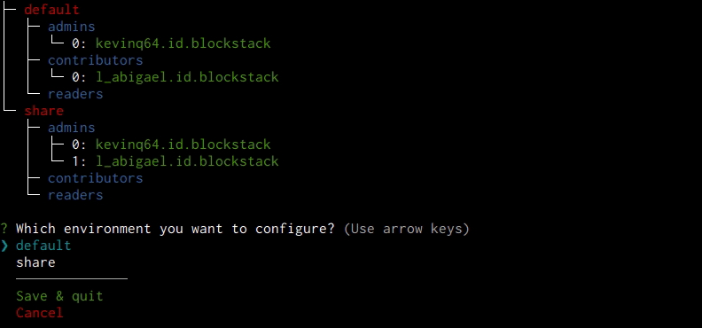

<p align="center">
  <a href="https://keystone.sh"></a>
</p>

<p align="center">
  <a href="https://github.com/wearedevx/keystone"></a>
</p>

**Table of content**

- [Installation](#installation)
  - [Login with Blockstack](#login-with-blockstack)
  - [Why do I have to sign on Keystone.sh?](#why-do-i-have-to-sign-on-keystonesh)
- [Create your first project and invite users](#create-your-first-project-and-invite-users)
  - [Create a project](#create-a-project)
  - [Invite a member to your project](#invite-a-member-to-your-project)
  - [Give access to the project.](#give-access-to-the-project)
    - [Project roles definitions](#project-roles-definitions)
  - [Join a project](#join-a-project)
  - [Remove member](#remove-member)
- [Manage different environments](#manage-different-environments)
  - [Add new environments](#add-new-environments)
  - [Fetch files from an environment](#fetch-files-from-an-environment)
  - [Reset your local files with the latest synced files](#reset-your-local-files-with-the-latest-synced-files)
  - [List environments created in the project](#list-environments-created-in-the-project)
  - [Configure the environment](#configure-the-environment)
    - [Environment roles definitions](#environment-roles-definitions)
  - [Remove an environment](#remove-an-environment)
- [Keep your secrets in sync with others](#keep-your-secrets-in-sync-with-others)
  - [Push files into storage](#push-files-into-storage)
  - [Check if files tracked with Keystone are modified](#check-if-files-tracked-with-keystone-are-modified)
  - [Check differences between a modified file and the lastest synced version](#check-differences-between-a-modified-file-and-the-lastest-synced-version)
  - [Fetch files from storage](#fetch-files-from-storage)
  - [Delete files from your environment](#delete-files-from-your-environment)
  - [Manage conflicts](#manage-conflicts)
  - [Conflict between remote files claiming to be the latest version](#conflict-between-remote-files-claiming-to-be-the-latest-version)
- [Share secrets to non-blockstack users (CI/CD use cases)](#share-secrets-to-non-blockstack-users-cicd-use-cases)
- [About Blockstack](#about-blockstack)
- [Recipes](#recipes)

## Installation

To install the latest version of Keystone CLI, run this command:

```shell
$ npm i -g @keystone.sh/cli # or yarn global add @keystone.sh/cli
```

#### Login with Blockstack

Keystone is built on Blockstack, a decentralized computing network and app ecosystem. You will need an account in order to login on Keystone. [Learn more.](#about-blockstack)

```shell
$ ks login account.id.blockstack # sign with your blockstack id
```

#### Why do I have to sign-in on Keystone.sh?

The sign-in in process that happens between your terminal and keystone.sh allow you to access the Blockstack platform outside your browser. It makes sharing and contributing secrets possible between many users in a secure way.

As the source code is available on Github, you can freely host your own version and register your app to Blockstack.

## Create your first project and invite users

### Create a project

A keystone project is made of **members** and **environments**. When you initialize your first project, you are the only member with the **admin** role. An environment called **default** is created.

`$ ks init PROJECT_NAME`

### Invite a member to your project

`$ ks invite email@domain.com`

> Note: The invitee will receive an email to accept or refuse the invitation. If he accepts, you will receive a confirmation by email.

You can send invtitations to many people at once:

`$ ks invite email1@domain.com email2@domain.com ...`

### Give access to the project.

In order to allow people to fetch files from you and other teammates you need to add them in your project and _assign them to at least 1 environment_. Under the hood it will encrypt the projects files with their signed public key.

There are two ways to do so :

1. In the confirmation mail, click the link. You'll be redirected to keystone.sh. A configuration form lets you choose to which environment you want the user to access.
2. Use the **add** and **env config** command in your shell:

   **First,** add a user _who accepted your invitation_ to the project

   ```bash
   $ ks add example.id.blockstack example@mail.com
   ```

   > Note: you need to be sure the user accepted your invitation before using the **add** command. It will not work otherwise. You also need to know their blockstack ID.

   **Then**, set members roles for your current environment

   ```bash
   $ ks env config
   ```

   > The `ks env config` command is an interactive prompt that allows you to change users role in any environment. See [next section](#manage-different-environments).

By default, a user is added to the project as a **reader**. To change the role, use `$ ks project config`.

#### Project roles definitions

- **reader** : can't do anything regarding the project itself.
- **contributor** : can add or remove environments.
- **administrator** : can add or remove environments, add and remove users, change users roles.

### Join a project

In order to join a project, you must have received an invitation from a project administrator. The invitation is sent by email and you need to accept it to join the project.

In most cases, a `.ksconfig` will be at your root project folder if the project is Git versionned. This file tells **Keystone** from where to fetch.

> If you are the project owner, you need to add .ksconfig to your git repo. It's the link to the keystone project and allows everyone to stay in sync.

If you don't have a `.ksconfig` yet. Run `$ ks init PROJECT_NAME`.

> Note: a project name is composed of its name plus a unique identifier.

You can then use `$ ks checkout ENV_NAME` to sync files from environment **ENV_NAME**.

**You can only pull when you've been invited to the project with the right permissions on the selected environment.**

### Remove member

If you are a project administrator, you can remove any member.

```bash
$ ks remove blockstack_id
```

The member won't get updates anymore. A good practice is to change all your sensitive information, such as API tokens, as this member could have saved them locally.

## Manage different environments

You can think of an environment as a place where you store your files. Each environment has its own members and files. This allows you to seperate responsabilities. Production secrets could be managed and readable only by your devOps team for example.

You can create as many environments as you like. When you initialize a project, a "default" environment is created.

### Add new environments

`$ ks env new ENV_NAME`

### Fetch files from an environment

`$ ks env checkout ENV_NAME`

### Reset your local files with the latest synced files

`$ ks env reset`

### List environments created in the project

`$ ks list environments`

### Configure the environment

The administrator of the environment (initially the one that created it) can set a role to members.

`$ ks env config`

#### Environment roles definitions

- **reader** : can only read files from the the environment and pull them locally
- **contributor** : can read, write and add new files to the environment
- **administrator** : all the above, plus can configure roles for members in the environment

<br/>

### Remove an environment

`$ ks env remove ENV_NAME`

> You need to be administrator or a project contributor in order to create, modify and remove an environment.

## Keep your secrets in sync with others

### Push files into storage

```bash
$ ks push PATH_TO_FILE
```

Pushing files for the first time will add them to your environment. Once added, they will be tracked by keystone.
To push modified tracked files:
`$ ks push`

> Note: each environment is separated from the others. Files pushed to an environment can only be accessed by members of that environment.
>
> You can't push files if you are not up to date with your teammates. You will need to pull their files and merge your changes locally.

### Check if files tracked with Keystone are modified

`$ ks status`

### Check differences between a modified file and the lastest synced version

`$ ks diff PATH_TO_FILE`

### Fetch files from storage

Pull files from your current environment and write them locally on your machine.

`$ ks pull`

> Note: if you have modified files and you want to override them, use --force flag.

When pulling files, keystone looks for a newer version of every files in the environment. Once pulled, these files can be on one of the **three following state** :

- You have no pending modification. The files on your machine will be updated.

- You made changes but it can be merged with the newer version. The new modifications will be added to your changes.

- You made changes but it cannot be merged with the newer version. A conflict file will be created and written as a replacement to your file. See [manage conflicts](#manage-conflict).
  > Note: you need to manage conflicts before you push your changes. You don't want your teammates to fecth conflicting files.

### Delete files from an environment

If you're an administrator or a contributor, the files will be removed for everyone.
If you're a reader on the environment, you can't delete any files.

```bash
$ ks delete path/to/file
$ ks delete path/to/folder/*  # Accept global pattern
```

### Manage conflicts

When keystone detects a conflict during a merge, it will edit the content of the affected files with visual indicators that mark both sides of the conflicted content. These visual markers are: <<<<<<<, =======, and >>>>>>>.

Example :

```diff
 <<<<<<< CURRENT CHANGES
I'm a conflicting content
that needs to be merged manually.
=======
I'm a super conflicting content
>>>>>>> INCOMING CHANGES
```

Just like Git, you need to merge changes manually and push with `$ ks push`

### Conflict between remote files claiming to be the latest version

&#9888; _This should be very rare._

Because of the decentralized aspect of Blockstack, two files might be uploaded at the same time describing themselves as the latest version. Their content might be different. In this case, keystone will tell you that the files you're trying to pull are conflicting.

This will happens only for contributors and administrators. **Readers and Shared tokens will get the latest stable version.**

An editor will pop on the terminal in order to fix the conflict. Once saved, the process will continue.

## Share secrets to non-blockstack users (CI/CD use cases)

You can share files from your environments to any user with the **share** command. It's especially usefull for automatic deployment systems like Github Actions or Gitlab CI/CD workflow.

`$ ks share ENV_NAME`

This command generates a token with the informations you need to pull files from the selected environment.
It's like a member with reader permissions on the environment and only one command available: `$ ks pull`

> Running the command again will override the user configuration and generate a new token. The previous token will then not be valid.
>
> You have only one token by environment.

To use it, set the token in the user's process environment under **KEYSTONE_SHARED**.

```bash
$ export KEYSTONE_SHARED=TOKEN
$ ks pull
```

## About Blockstack

Blockstack is a **decentralized** computing network and app ecosystem that puts users in control of their identity and data.

Blockstack provides private data lockers and a universal login with blockchain based security and encryption.

We leverage that technology to give developers a safe and easy way to manage secrets in their apps. A new way where every bit of data stays yours and is encrypted by default.

The platform handles user authentication using the Blockstack Naming Service (BNS), a decentralized naming and public key infrastructure built on top of the Bitcoin blockchain. It handles storage using Gaia, a scalable decentralized key/value storage system that looks and feels like localStorage, but lets users securely store and share application data via user-selected storage systems.
[Learn more](https://blockstack.com)

## Recipes

- [Enable autocompletion](recipes/autocomplete/README.md)
- [Customize your prompt with project status](recipes/prompt/README.md)
- [Use shared user to automate deployment with your secrets](recipes/autocomplete/README.md)
