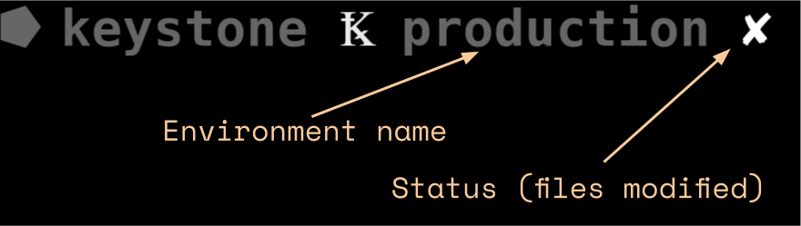

 Customize your prompt

This tutorial is meant for you to customize your shell prompt with your Keystone project's related info.

<p align="center">
    
</p>

The ks_prompt executable file can take one argument.

```
$ ks_prompt env
```

Print your current environment.

```
$ ks_prompt status
```
Print ✘ if you made changes to a keystoned file.

Print ✔ if no changes have been made to any keystoned file.

```
$ ks_prompt full
```

Print a ready to use string that show current environment along with ✘ ✔ to show respectably if changes have been made to a keystoned file or not. `Ꝅ production ✘`

From this, you are able to add this info anywhere you want in your prompt, in any shell.
## Installation


```
$ curl https://raw.githubusercontent.com/wearedevx/keystone/master/docs/recipes/prompt/ks_prompt.c > ks_prompt.c

$ make ks_prompt

$ sudo cp ks_prompt /usr/local/bin # or anywhere in your path
```
## Setup
### oh-my-zsh

Get the the in your custom ZSH directory

```bash
$ curl -L https://raw.githubusercontent.com/wearedevx/keystone/master/docs/recipes/prompt/keystonize.zsh-theme > $ZSH/themes/keystonize.zsh-theme

$ curl -L https://raw.githubusercontent.com/wearedevx/keystone/master/docs/recipes/prompt/ks_status.zsh > $ZSH/lib/ks_status.zsh 

```

Replace in your ~/.zshrc to following line

```ZSH_THEME="keystonize"```


### bash

Add the following at the end of your ~/.bashrc.
```bash
keystone_info() {
     ENV=$(ks_prompt env)
     STATUS=$(ks_prompt status)
     s=" "
     if [[ -n $ENV ]]; then
         s+="Ꝅ $ENV"
         s+=" $STATUS "
     fi
     echo "$s"
 }


 PS1='\[\e[32m\]\u\[\e[m\]\[\e[32m\]@\[\e[m\]\[\e[32m\]\h\[\e[m\]:\[\e[34m\]\w\[\e[m\]$(keystone_info)\$ '
```
